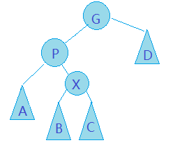
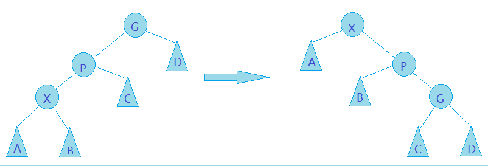

# 伸展树SplayTree
## 结构性质
* 基本思想：当一个节点被访问后，要经过一系列AVL旋转树的旋转放到根上。
* 我们要在访问路径上的每一个节点和他们的父节点实施旋转，这会将被访问节点一直推向根。
## 基本操作
### Find⭐
使用**展开(Splay)**实现将被访问的节点X推向根节点:

#### 自底向上（不好实现）:
* 对访问路径上的每个点执行操作：
* 如果X的父节点是根，只接旋转X和根节点
* 否则说明其有祖父节点：
    * 之字形(zig-zag)情形:X是右子节点，X的父节点是左子节点(以及对称的另一种情况)。执行一次**双旋转**  
    
    * 一字型(zig-zig)情形:X是左子节点，X的父节点也是左子节点(以及对称的另一种情况)。执行一次一字型旋转  
    （其实可以执行三次单旋转来完成，分别对singleRotation(P) singlRotation(G) singleRotation(G)
     

实现原创:
 1. 递归地向下寻找时记录路径
 2. 递归返回时，返回所处理的节点与X节点的路径长
 3. 如果下一层递归返回上来的路径长为1，则说明该层递归所处理的节点与X节点的路径长为2，可以进行旋转操作，然后返回0
 4. 如果没由找到，则返回一个大于等于2的数，使旋转操作无法执行。

#### 自顶向下 (易实现)
* 访问的任一阶段，当前节点X是“中间树”的根，树L存放小于X的节点（不储存X的子节点），树R存放大于X的节点（不储存X的子节点）
* 初始时，“中间树”为原来的树，L、R树为空
* 若要访问的节点在X的左子树中，**X接到R树中最小节点的左侧，然后X成为新的最小节点**：
* 可以通过更多的测试，进行更复杂的旋转，减少循环层数：
* 最后合并L、R和中间的树：

* 实现技巧
```
Node header;
header.left = nullptr;  //用header的左子节点表示R
header.right = nullptr; //而用header的右子节点表示L

LeftTreeMax = &header;
RightTreeMin = &header;
```
### FindMin/FindMax
### Insert
### Delete
* 将该节点X旋转到根上。
* 删除该节点则得到左子树TL和右子树TR。
* 将TL中最大的元素旋转到TL的根上，此时，TL的没有右子节点。
* 使TR成为TL的根的右子节点，则完成删除。